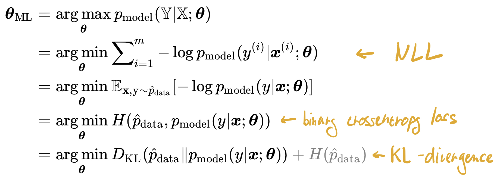
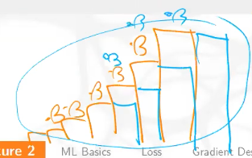

# Lekce 2

> Describe maximum likelihood estimation, as minimizing NLL, cross-entropy and KL divergence. [10]

Self information

- $I(x) = -\log P(x)$
- Jak moc jsme překvapeni, když dostaneme $x \sim P$
- Pro nezávislé jevy se sčítá, pro jevy s pností 1 je rovna 0

Entropie

- $H(P) = \mathbb{E}_{x \sim P} [I(x)] = - \mathbb{E}_{x \sim P} [\log P(x)]$
- Množství překvapení v distribuci $P$

Cross-entropy

- $H(P, Q) = -\mathbb{E}_{x\sim P} [\log Q] = \mathbb{E}_{x\sim P} [I_Q(x)]$
- V podmíněném případě pak $H(Y|X) = H(X, Y) - H(X)$, tedy jak moc jsem překvapen když se dozvím obojí oproti tomu, když se dozvím jen $X$
- Měří, jak moc budu překvapený, když budu tahat $x$ z distribuce $P$, ale své překvapení budu měřit na základě distribuce $Q$

Kullback-Leibler Divergence

- $D_{KL}(P || Q) = H(P, Q) - H(P) = -\mathbb{E}_{x\sim P} [\log P - \log Q]$
- Není symetrická
- V zásadě říká, jak "špatná" je moje distribuce $Q$. Konkrétně zjišťuje o jak moc více budu překvapen, když tahám $x$ z $P$, ale překvapení měřím skrze $Q$
  - Čím jsou si $Q$ a $P$ podobnější, tím menší tohle "překvapení navíc" bude

MLE

- Samo o sobě je to takové hledání parametrů modelu, aby
  $$
  \theta_{\mathrm{ML}}=\underset{\theta}{\arg \max} \space p_{\text {model }}(\mathbb{X} ; \theta)
  $$
  Což se dá dále upravovat, až se dostaneme NLL, binární crossentropii, a KL divergenci

> Define mean squared error and show how it can be derived using MLE. [5]

$$
MSE = \mathbb{E}[(\hat{y} - y)^2] = \frac{1}{m} \sum_{i=1}^m \left((f(x_i; \theta) - y_i)^2\right)
$$

Pokud se nám při regresi nechce odhadovat celá distribuce, můžeme si usnadnit práci, predikovat pouze její střední hodnotu a říct, že ta distribuce je normální s nějakým rozptylem (a s tou naší střední hodnotou). 

Dává to smysl, protože normální rozdělení má mezi rozděleními se stejnou střední hodnotou a rozptylem maximální entropii, tedy nejméně navíc vnesené informace.

MLE potom vyjde
$$
\begin{aligned}
\arg \max _{\boldsymbol{\theta}} p(y \mid \boldsymbol{x} ; \boldsymbol{\theta}) &=\underset{\boldsymbol{\theta}}{\arg \min } \sum_{i=1}^{m}-\log p\left(y^{(i)} \mid \boldsymbol{x}^{(i)} ; \boldsymbol{\theta}\right) \\
&=\underset{\boldsymbol{\theta}}{\arg \min }-\sum_{i=1}^{m} \log \sqrt{\frac{1}{2 \pi \sigma^{2}}} \exp\left({-\frac{\left(y^{(i)}-\hat{y}\left(\boldsymbol{x}^{(i)} ; \boldsymbol{\theta}\right)\right)^{2}}{2 \sigma^{2}}}\right) \\
&=\underset{\boldsymbol{\theta}}{\arg \min }-m \log \left(2 \pi \sigma^{2}\right)^{-1 / 2}-\sum_{i=1}^{m}-\frac{\left(y^{(i)}-\hat{y}\left(\boldsymbol{x}^{(i)} ; \boldsymbol{\theta}\right)\right)^{2}}{2 \sigma^{2}} \\
&=\underset{\boldsymbol{\theta}}{\arg \min } \sum_{i=1}^{m} \frac{\left(y^{(i)}-\hat{y}\left(\boldsymbol{x}^{(i)} ; \boldsymbol{\theta}\right)\right)^{2}}{2 \sigma^{2}}=\underset{\boldsymbol{\theta}}{\arg \min } \frac{1}{m} \sum_{i=1}^{m}\left(y^{(i)}-\hat{y}\left(\boldsymbol{x}^{(i)} ; \boldsymbol{\theta}\right)\right)^{2}
\end{aligned}
$$
To $1/m$ jsme si nakonec přimysleli, protože můžeme. MSE tedy dává smysl jako loss funkce, ale **pouze pokud má náš estimátor pevný rozptyl (tj. vlastně chybu) $\sigma^2$**.

> Describe gradient descent and compare it to stochastic (i.e., online) gradient descent and minibatch stochastic gradient descent. [5]

Pokud máme nějaký loss $L$ a nějaká trénovací data, chceme při tréninku minimalizovat
$$
J(\boldsymbol{\theta})=\mathbb{E}_{(\boldsymbol{x}, y) \sim \hat{p}_{\text {data }}} L(f(\boldsymbol{x} ; \boldsymbol{\theta}), y)
$$
Což můžeme udělat v krocích pomocí tzv. **gradient descent** s learning rate $\alpha$
$$
\boldsymbol{\theta} \leftarrow \boldsymbol{\theta}-\alpha \nabla_{\boldsymbol{\theta}} J(\boldsymbol{\theta})
$$
Druhy

- V běžném GD počítáme $J$ a jeho gradient ze všech trénovacích dat
- V **online (stochastic) gradient descent** nasamplujeme pouze jedno dato
- V **minibatch SGD** vybereme $m$ samplů, ze kterých poté odhadujeme střední hodnotu $J$

> Formulate conditions on the sequence of learning rates used in SGD to converge to optimum almost surely. [5]

SGD skoro jistě konverguje k optimu, pokud je naše loss spojitá a konvexní a zároveň pro learning raty platí
$$
\forall i: \alpha_{i}>0, \quad \sum_{i} \alpha_{i}=\infty, \quad \sum_{i} \alpha_{i}^{2}<\infty
$$
Tedy můžeme složením krůčků dojít kamkoli, ale zároveň musí platit $\alpha \to 0$. Konkrétně to *na druhou* se tam vyskytuje za MSE, říká v podstatě že "nabraná chyba bude konečná".

> Write down the backpropagation algorithm. [5]

Chceme spočítat derivaci posledního vrcholu ($u_n$) vzhledem ke všem předešlým vrcholům. Tím získáme derivaci loss vůči parametrům, což je to, co potřebujeme do SGD.

1. Spustíme forward propagation, kterým spočteme hodnoty všech vrcholů
2. Nastavíme $g_n = 1$
3. Od konce počítáme $g_i$ jako $\sum_{j: i \in P\left(u^{(j)}\right)} g^{(j)} \frac{\partial u^{(j)}}{\partial u^{(i)}}$, využití chain rule

> Write down the mini-batch SGD algorithm with momentum. Then, formulate SGD with Nesterov momentum and show the difference between them. [5]

$$
\begin{array}{l}
\boldsymbol{g} \leftarrow \frac{1}{m} \nabla_{\boldsymbol{\theta}} \sum_{i} L\left(f\left(\boldsymbol{x}^{(i)} ; \boldsymbol{\theta}\right), \boldsymbol{y}^{(i)}\right) \\
\boldsymbol{v} \leftarrow \beta \boldsymbol{v}-\alpha \boldsymbol{g} \\
\boldsymbol{\theta} \leftarrow \boldsymbol{\theta}+\boldsymbol{v}
\end{array}
$$

Navíc oproti SGD tam je to $v$, které zajišťuje roli "kudy jsme šli minule". V Nestor momentum je to pak jen trochu pozměněno, *momentum krok* se dělá _před_ výpočtem gradientu, tak, aby ten samotný gradient byl přesnější.
$$
\begin{array}{l}
\boldsymbol{\theta} \leftarrow \boldsymbol{\theta}+\boldsymbol{\beta} \boldsymbol{v}\\
\boldsymbol{g} \leftarrow \frac{1}{m} \nabla_{\boldsymbol{\theta}} \sum_{i} L\left(f\left(\boldsymbol{x}^{(i)} ; \boldsymbol{\theta}\right), y^{(i)}\right) \\
\boldsymbol{v} \leftarrow \beta \boldsymbol{v}-\alpha \boldsymbol{g} \\
\boldsymbol{\theta} \leftarrow \boldsymbol{\theta}-\alpha \boldsymbol{g}
\end{array}
$$

> Write down the AdaGrad algorithm and show that it tends to internally decay learning rate by a factor of $1/t$ in step $t$. Then write down the RMSProp algorithm and explain how it solves the problem with the involuntary learning rate decay. [10]

$$
\begin{array}{l}
\boldsymbol{g} \leftarrow \frac{1}{m} \nabla_{\boldsymbol{\theta}} \sum_{i} L\left(f\left(\boldsymbol{x}^{(i)} ; \boldsymbol{\theta}\right), y^{(i)}\right) \\
\boldsymbol{r} \leftarrow \boldsymbol{r}+\boldsymbol{g}^{2} \\
\boldsymbol{\theta} \leftarrow \boldsymbol{\theta}-\frac{\alpha}{\sqrt{\boldsymbol{r}+\varepsilon}} \boldsymbol{g}
\end{array}
$$

Velikosti gradientu normalizujeme, aby se paramentry s různými rozptyly měnily zhruba stejně. To, co máme uloženo v $r$, si můžeme představit zhruba jako $\sigma^2$ jednotlivých složek, takže vydělení learning ratu $\sqrt{r + \varepsilon}$ provede normalizaci. 

Pokud zůstávají gradienty dlouho stejné, tj $g \approx g_0$, tak po $t$ krocích algoritmu je $r \approx t \cdot g_0^2$, a proto
$$
\frac{\alpha}{\sqrt{\boldsymbol{r}+\varepsilon}} \approx \frac{\alpha / \sqrt{t}}{\sqrt{\boldsymbol{g}_{0}^{2}+\varepsilon / t}},
$$
jinými slovy, jako kdybychom learning rate škálovali $1/\sqrt{t}$, což zpravidla nechceme, protože to může být moc rychlé.

RMSPRop funguje podobně, ale $r$ počítáme tak, aby zhruba odpovídalo střední hodnotě poslechních $g^2$ — počítáme exponenciální průměr posledních několika hodnot.
$$
\begin{array}{l}
\boldsymbol{g} \leftarrow \frac{1}{m} \nabla_{\boldsymbol{\theta}} \sum_{i} L\left(f\left(\boldsymbol{x}^{(i)} ; \boldsymbol{\theta}\right), y^{(i)}\right) \\
\boldsymbol{r} \leftarrow \beta \boldsymbol{r}+(1-\beta) \boldsymbol{g}^{2} \\
\boldsymbol{\theta} \leftarrow \boldsymbol{\theta}-\frac{\alpha}{\sqrt{\boldsymbol{r}+\varepsilon}} \boldsymbol{g}
\end{array}
$$
Jak tento exponenciální průměr funguje je ukázáno na následujícím obrázku.

> Write down the Adam algorithm. Then show why the bias-correction terms $(1−\beta ^ t)$ make the estimation of the first and second moment unbiased. [10]

Adam je spojením momentum a RMSProp. 
$$
\begin{array}{l}
\boldsymbol{g} \leftarrow \frac{1}{m} \nabla_{\boldsymbol{\theta}} \sum_{i} L\left(f\left(\boldsymbol{x}^{(i)} ; \boldsymbol{\theta}\right), y^{(i)}\right)\\
t \leftarrow t+1\\
\boldsymbol{s} \leftarrow \beta_{1} \boldsymbol{s}+\left(1-\beta_{1}\right) \boldsymbol{g} \text { (biased first moment estimate) }\\
\boldsymbol{r} \leftarrow \beta_{2} \boldsymbol{r}+\left(1-\beta_{2}\right) \boldsymbol{g}^{2} \text { (biased second moment estimate) }\\
\hat{\boldsymbol{s}} \leftarrow \boldsymbol{s} /\left(1-\beta_{1}^{t}\right), \hat{\boldsymbol{r}} \leftarrow \boldsymbol{r} /\left(1-\beta_{2}^{t}\right)\\
\boldsymbol{\theta} \leftarrow \boldsymbol{\theta}-\frac{\alpha}{\sqrt{\hat{\boldsymbol{r}}+\varepsilon}} \hat{\boldsymbol{s}}
\end{array}
$$
První moment odpovídá momentum, druhý používáme kvůli normalizaci LR, stříškové verze složí jako korekce biasů. Po $t$ krocích totiž $r$ vypadá jako
$$
\boldsymbol{r}_{t}=\left(1-\beta_{2}\right) \sum_{i=1}^{t} \beta_{2}^{t-i} \boldsymbol{g}_{i}^{2}
$$
Tedy jako bych dělal vážený průměr nějakých prvků s celkovouv vahou
$$
\left(1-\beta_{2}\right) \sum_{i=1}^{t} \beta_{2}^{t-i}=\left(1-\beta_{2}\right) \frac{1-\beta_{2}^{t}}{1-\beta_{2}}=1-\beta_{2}^{t} .
$$
Jinými slovy, 
$$
\mathbb{E}\left[\boldsymbol{r}_{t}\right] \approx \mathbb{E}\left[\boldsymbol{g}^{2}\right] \cdot\left(1-\beta_{2}^{t}\right)
$$
A biasu se tedy zbavím vydělením.
