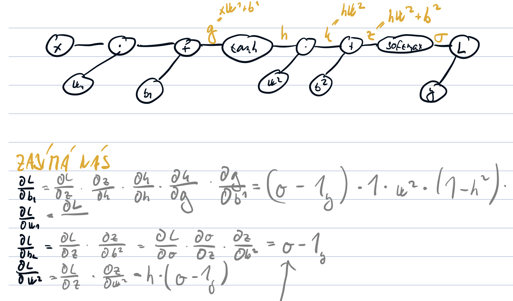

# Lecture 3

> Considering a neural network with $D$ input neurons, a single ReLU hidden layer with $H$ units and softmax output layer with $K$ units, write down the formulas of the gradient of all the MLP parameters (two weight matrices and two bias vectors), assuming input $x$, target $t$ and negative log likelihood loss. [10]

Označme $z$ jako vstup do poslední vrstvy a $g$ jako zlatou distribuci, poté $\frac{\partial L}{\partial \boldsymbol{z}}=\boldsymbol{o}-\boldsymbol{g}$. Zbytek z chain rule, stačí si rozkreslit síť do jednotlivých vrcholů.

> Assume a network with MSE loss generated a single output $o \in \mathbb{R}$, and the target output is $g$. What is the value of the loss function itself, and what is the gradient of the loss function with respect to $o$? [5]

Hodnota loss je $(o - g)^2$, gradient je prostě derivace přechozího výrazu, tedy $2(o - g)$.

> Assume a network with cross-entropy loss generated a single output $z \in \mathbb{R}$, which is passed through the sigmoid output activation function, producing $o = \sigma(z)$ If the target output is $g$, what is the value of the loss function itself, and what is the gradient of the loss function with respect to $z$? [5]

Hodnota loss je $- ∑ g_i \log \boldsymbol{o_i}$. Gradient se těžko počítá vůči $o$, ale vůči $z$ je roven $o-g$.

> Assume a network with cross-entropy loss generated a k-element output $z \in \mathbb{R}^K$, which is passed through the softmax output activation function, producing $o=softmax(z)$. If the target distribution is $g$, what is the value of the loss function itself, and what is the gradient of the loss function with respect to $z$? [5]

Hodnota loss je $- ∑ g_i \log \boldsymbol{o_i}$. Gradient se těžko počítá vůči $o$, ale vůči $z$ je roven $\boldsymbol{o}-\boldsymbol{g}$.

> Define L2 regularization and describe its effect both on the value of the loss function and on the value of the loss function gradient. [5]

Regularizace je obecně cokoli, co má za cíl snížit generalizační chybu. L2 regularizace zmenšuje váhy, 
$$
\tilde{J}(\boldsymbol{\theta} ; \mathbb{X})=J(\boldsymbol{\theta} ; \mathbb{X})+\lambda\|\boldsymbol{\theta}\|_{2}^{2},
$$
což se poté projeví v gradientu jako
$$
\boldsymbol{\theta}_{i} \leftarrow \boldsymbol{\theta}_{i}-\alpha \frac{\partial J}{\partial \boldsymbol{\theta}_{i}}-2 \alpha \lambda \boldsymbol{\theta}_{i}
$$

> Describe the dropout method and write down exactly how is it used during training and during inference. [5]

Chceme, aby naše neurony (resp. jejich váhy) byly dobré a nezávislé na ostatních, proto při trénování s pností $p$ neuron vyřadíme (tj nastavíme mu hodnotu 0).

Při inferenci k dropoutu nedochází, a protože máme najednou více neuronů než jsme měli při trénování, naškálujeme všechny jejich výstupy $(1-p)$ krát. Případně můžeme naopak při tréninku naškálovat výstupy neuronů nahoru, $1/(1-p)$ krát.

> Describe how label smoothing works for cross-entropy loss, both for sigmoid and softmax activations. [5]

Někdy dochází k overfittingu, protože se MLE snaží dotáhnout poslední procentíčko v nějaké 99,99% predikci — taková predikce nám ale běžně stačí. Proto jako gold distribuci nebereme one-hot, ale $(1 - \alpha) \cdot \bold{1}_{gold} + \alpha \cdot 1/(\text{# classes})$.

> How are weights and biases initialized using the default Glorot initialization? [5]

Biasy na 0, matice $\mathbb{R}^{m \times n}$ z distribuce $U\left[-\sqrt{\frac{6}{m+n}}, \sqrt{\frac{6}{m+n}}\right]$.

 Váhy nemohou být všechny 0, protože by se všechny trénovaly stejně — proto je inicializujeme náhodně. Tyto konkrétní hodnoty volíme proto, aby rozptyl vygenerovaných matic byl $1/n$, což poté pomůže zachovat stabilní rozptyl napříč skrytými vrstvami. Ten chceme proto, že pokud by se rozptyl měnil, například rostl, rostly by nám i hodnoty aktivací a gradienty.