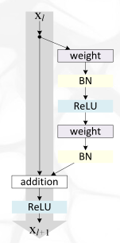
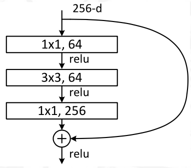
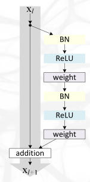

# Lekce 5

> Describe overall architecture of ResNet. You do not need to remember the exact number of layers/filters, but you should draw a bottleneck block (including the applications of BatchNorms and ReLUs) and state how residual connections work when the number of channels increases. [10]

Základní blok vypadá následovně, *weight* jsou 3x3 konvoluce. 

V bottleneck bloku jsou konvoluce tři, dvě z nich 1x1. Ušetří to parametry, takže síť může být hlubší. Vlastně v něm určujeme podbnožinu vstupních kanálů, kterým dovolíme spolu přes konvoluci interagovat.

Celá síť má několik takovýchto bottleneck bloků za sebou, se zvyšujícím se počtem kanálů uprostřed.

Mezi vrstvami convN_x se místo max poolingu dělá konvoluce se stridem 2, čímž se zamezí ztrátě informace.

Reziduální spojení nemohou být přímo aplikovány mezi jednotlivými convN_x vrstvami, protože mají různý počet kanálů. Používá se proto 1x1 konvoluce s BN *(a nejspíše bez aktivace)*.

> Draw the original ResNet block (including the exact positions of BatchNorms and ReLUs) and also the improved variant with full pre-activation. [5]

Originální blok vypadá následovně.

Zatímco full pre-activatin blok má ReLU uvnitř, a navíc je i s BN _před_ samotnými konvolucemi.

To funguje (z části i) proto, že při součtu výsledku s resiudální hranou se nám může rozbít ditribuce, takže je fajn i hned prohnat batch normem.

> Compare the bottleneck block of ResNet and ResNeXt architectures (draw the latter using convolutions only, i.e., do not use grouped convolutions). [5]

V ResNeXt rozdělíme blok na několik podbloků s menším počtem vnitřních kanálů. Původně by například každý ze 64 výstupních kanálů mohl být ovlivněn jakýmkoli ze vstupních 64 kanálů, v ResNeXt tyto interakce omezíme — jeden kanál bude ovlivňován třeba čtyřmi jinými. (vlevo ResNet, vpravo ResNeXt)

S tím, že horní i spodní konvoluce můžeme sloučit do jedné.

> Describe the CNN regularization method of networks with stochastic depth. [5]

Náhodně s pravděpodobností $1 - p-i$ dropneme celý $i$-tý blok (kromě jeho residualního spojení, ofc). Během inference výstup bloku $B_i$ vynásobíme $p_i$. 

Pravděpodobnost toho, že blok zůstane, $p_i$, nastavíme tak, aby klesala lineárně ke konci sítě (první vrstvy jsou důležitější, nechceme je dropovat tak často). 
$$
p_i = 1 - \frac{i}{L} (1 - p_L)
$$

> Compare Cutout and DropBlock. [5]

Cutout nahradí náhodný souvislý čtvercový kus obrázku průměrnou hodnotou, ve všech kanálech. DropBlock dropuje obdélníkové oblasti nezávisle v každém kanálu.

Takže rozdíl je jednak v přístupu ke kanálům, a také v tom, že cutout hodnoty nahrazuje fake hodnotou, zatímco DropBlock je prostě zahodí. Cutout se (tím pádem?) používá jen na vstupních obrázcích, zatímco DropBlock kdykoli uvnitř sítě.

Obojí je lepší než běžný dropout, protože v obrázcích je lepší zahazovat sousední pozice, abychom opravdu tu informaci odstranili.

> Describe Squeeze and Excitation applied to a ResNet block. [5]

SE chce obecně dovolit kanálům nějakým způsobem globálně interagovat; kovoluce umožňují jen lokální interakci. Squeeze spočítá průměr každého kanálu (global pooling), excitation přiřkne každému kanálu váhu 0–1, kterou daný kanál vynásobíme (sigmoid).

Mezi S a E vrstvami jsou FC vrstvy, které se právě starají o ty globální interakce. Místo jedné CxC FC vrstvy máme dvě, první redukující na C/r a druhou naopak nafukující zpět na C. Oproti běžnému CxC tímto ušetříme parametry. Podobná myšlenka jako u ResNet bottleneck bloků.

> Draw the Mobile inverted bottleneck block (including explanation of separable convolutions, the expansion factor, exact positions of BatchNorms and ReLUs, but without describing Squeeze and excitation bocks). [5]

Separable konvoluce nematchuje každý vstupní kanál ke každému z výstupních, ale matchuje je jedna ku jedná. Tj výstupních musí být stejně jako vstupních, a celá operace je mnohem ryhlejší.

MIB bloky se chovají trochu jako bloky WideNetu, dostanou $F$ kanálů, rozšíří je pomocí 1x1 konvoluce, poté udělají 3x3 konvoluci (separovanou, aby byla rychlejší), jejíž výstupem je tedy opět stejné rozšířené množství kanálů, a ty pak transformují zpět opět 1x1 konvolucí. Tato poslední konvoluce je bez aktivační funkce, protože ReLU zahazuje informace, což zrovna v tomto zúženém místě nechceme.

> Assume an input image $I$ of size $H \times W$ with $C$ channels, and a convolutional kernel $K$ with size $N\times M $ stride $S$ and $O$ output channels. Write down (or derive) the equation of transposed convolution (or equivalently backpropagation through a convolution to its inputs). [5]

$$
\frac{\partial L}{\partial I_{i, j, c}}=\sum_{m, i'} \sum_{n, j'} \sum_{o}
\frac{\partial L}{\partial(\mathrm{K} \star I)_{i', j', o}}
\frac{\partial(\mathrm{K} \star I)_{i', j', o}}{\partial I_{i,j,c}}
$$

Tento obecný vzorec vyplývá z chain rule, jde ale zjednodušit, protože některé ze sčítanců budou nulové. Některé cross-korelace $(\mathrm{K} \star I)_{i, j, o}$ totiž na některých pixelech $I_{i,j,c}$ vůbec nezávisí (tj. derivace je nula). 

Když vhodně omezíme $i', j'$ tak, aby seděly do stridu a my se zbavili nulových sčítanců, dá se vzorec napsat jako 
$$
\frac{\partial L}{\partial I_{i, j, c}}=\sum_{m \atop{i^{\prime} \space : \space i = i'\cdot S + m}} \sum_{n \atop{j^{\prime} \space : \space j = j' \cdot S + n}} \sum_{o}
\frac{\partial L}{\partial(\mathrm{K} \star I)_{i', j', o}}
K_{m,n,c,o}
$$