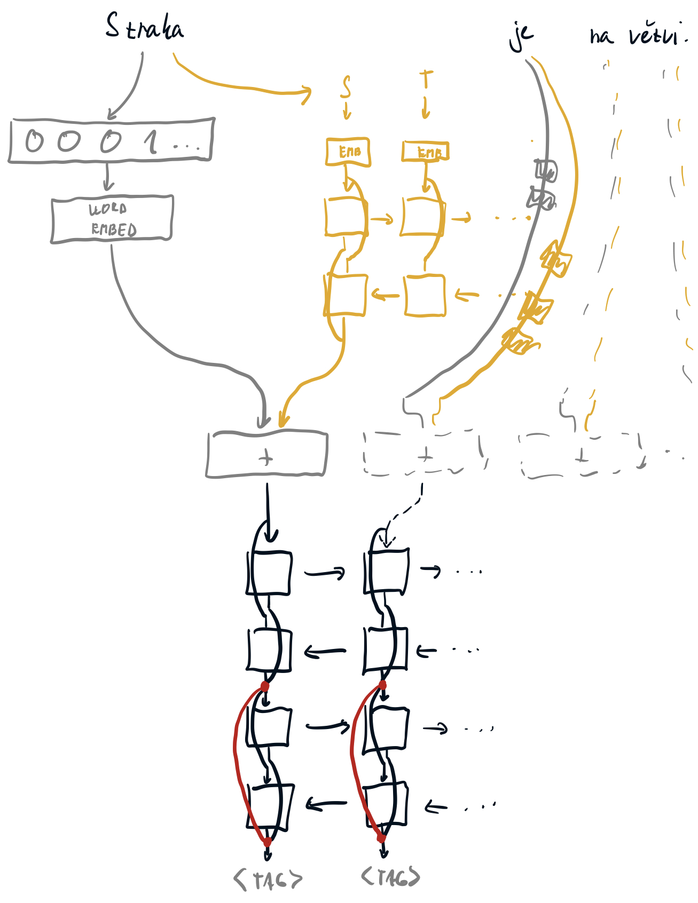

# Lekce 8

> Write down how the Long Short-Term Memory (LSTM) cell operates, including the explicit formulas. Also mention the forget gate bias. [10]

LSTM je vlastně Simple RNN buňka (tj $\tanh$ aktivovaná lineární kombinace vstupu a minulého stavu) rozšířená o paměť $c$ a tři řídící brány: input, output a v rozšířené verzi i forget.
$$
\begin{aligned}
\boldsymbol{i}_{t} & \leftarrow \sigma\left(\boldsymbol{W}^{i} \boldsymbol{x}_{t}+\boldsymbol{V}^{i} \boldsymbol{h}_{t-1}+\boldsymbol{b}^{i}\right) \\
\boldsymbol{f}_{t} & \leftarrow \sigma\left(\boldsymbol{W}^{f} \boldsymbol{x}_{t}+\boldsymbol{V}^{f} \boldsymbol{h}_{t-1}+\boldsymbol{b}^{f}\right) \\
\boldsymbol{o}_{t} & \leftarrow \sigma\left(\boldsymbol{W}^{o} \boldsymbol{x}_{t}+\boldsymbol{V}^{o} \boldsymbol{h}_{t-1}+\boldsymbol{b}^{o}\right) \\
\boldsymbol{c}_{t} & \leftarrow \boldsymbol{f}_{t} \cdot \boldsymbol{c}_{t-1}+\boldsymbol{i}_{t} \cdot \tanh \left(\boldsymbol{W}^{y} \boldsymbol{x}_{t}+\boldsymbol{V}^{y} \boldsymbol{h}_{t-1}+\boldsymbol{b}^{y}\right) \\
\boldsymbol{h}_{t} & \leftarrow \boldsymbol{o}_{t} \cdot \tanh \left(\boldsymbol{c}_{t}\right)
\end{aligned}
$$
Aktivace $\tanh$ se používá schválně, aby nám nemohly explodovat gradienty (gradient je < 1).

> Write down how the Gated Recurrent Unit (GRU) operates, including the explicit formulas. [10]

GRU je LSTM upravené tak, aby mělo méně parametrů. Oproti LSTM má:

- Reset gate, který je takovým posunutým Output gatem z LSTM. Slouží k určení, jakou část minulého stavu potřebujeme v současném výpočtu
- Update gate, který se stará o to, kterou část minulého stavu chceme zapomenout a nahradit něčím novým

$$
\begin{array}{l}
\boldsymbol{r}_{t} \leftarrow \sigma\left(\boldsymbol{W}^{r} \boldsymbol{x}_{t}+\boldsymbol{V}^{r} \boldsymbol{h}_{t-1}+\boldsymbol{b}^{r}\right) \\
\boldsymbol{u}_{t} \leftarrow \sigma\left(\boldsymbol{W}^{u} \boldsymbol{x}_{t}+\boldsymbol{V}^{u} \boldsymbol{h}_{t-1}+\boldsymbol{b}^{u}\right) \\
\hat{\boldsymbol{h}}_{t} \leftarrow \tanh \left(\boldsymbol{W}^{h} \boldsymbol{x}_{t}+\boldsymbol{V}^{h}\left(\boldsymbol{r}_{t} \cdot \boldsymbol{h}_{t-1}\right)+\boldsymbol{b}^{h}\right) \\
\boldsymbol{h}_{t} \leftarrow \boldsymbol{u}_{t} \cdot \boldsymbol{h}_{t-1}+\left(1-\boldsymbol{u}_{t}\right) \cdot \hat{\boldsymbol{h}}_{t}
\end{array}
$$

> Describe Highway network computation. [5]

Vypadá hodně podobně jako GRU, potažmo reziduální spojení. Do původní FC vrstvy
$$
\boldsymbol{y} \leftarrow H\left(\boldsymbol{x}, \boldsymbol{W}_{H}\right)
$$
přidáme přes trénovatelný gating i původní vstup
$$
\boldsymbol{y} \leftarrow H\left(\boldsymbol{x}, \boldsymbol{W}_{H}\right) \cdot T\left(\boldsymbol{x}, \boldsymbol{W}_{T}\right)+\boldsymbol{x} \cdot\left(1-T\left(\boldsymbol{x}, \boldsymbol{W}_{T}\right)\right),
$$
kde většinou $T\left(\boldsymbol{x}, \boldsymbol{W}_{T}\right) \leftarrow \sigma\left(\boldsymbol{W}_{T} \boldsymbol{x}+\boldsymbol{b}_{T}\right)$.

> Why the usual dropout cannot be used on recurrent state? Describe how can the problem be alleviated with variational dropout. [5]

Když budeme naivně náhodně dropovat ze stavu, nakonec nám tam moc dlouhodobých informací nezbyde — ale to je celý point RNN. Dropoutuje se ale běžně na vstupech i výstupech.

Variational dropout používá jednu masku na vstupy, jednu masku na výstupy, a jednu masku na stav; tím pádem se masky nemění v čase, a na některých místech nám dlouhodobá informace zůstane.

> Describe layer normalization and write down an algorithm how it is used during training and an algorithm how it is used during inference. [5]

Pro RNN lepší než batchnorm. Funguje stejně jako batchnorm, s tím rozdílem, že normalizuje úplně celou vrstvu v rámci jednoho examplu. Tedy pro vstupy $x_i$ dané vrstvy v rámci jednoho example
$$
\begin{array}{l}
\boldsymbol{\mu} \leftarrow \frac{1}{m} \sum_{i=1}^{m} \boldsymbol{x}^{(i)} \\
\boldsymbol{\sigma}^{2} \leftarrow \frac{1}{m} \sum_{i=1}^{m}\left(\boldsymbol{x}^{(i)}-\mu\right)^{2} \\
\hat{\boldsymbol{x}}^{(i)} \leftarrow\left(\boldsymbol{x}^{(i)}-\boldsymbol{\mu}\right) / \sqrt{\boldsymbol{\sigma}^{2}+\varepsilon} \\
\boldsymbol{y}^{(i)} \leftarrow \boldsymbol{\gamma} \hat{\boldsymbol{x}}^{(i)}+\boldsymbol{\beta}
\end{array}					
$$
Během inference si už nemusíme pamatovat předpočítané hodnoty $\mu$ a $\sigma^2$, prostě je spočítáme z konkrétních vstupů, které dostaneme.

> Sketch a tagger architecture utilizing word embeddings, recurrent character-level word embeddings and two sentence-level bidirectional RNNs with a residual connection. [10]

Nejblíže je tento slide, i když na konci by měla být ještě jedna vrstva.

S dvěma vrstvami na konci s reziduálními spojenímy by to mohlo vypadat nějak takto.

